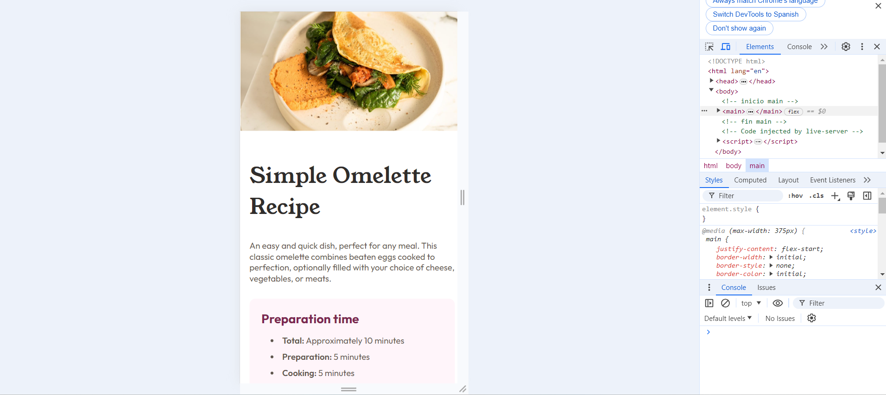

# Frontend Mentor - Recipe page solution

This is a solution to the [Recipe page challenge on Frontend Mentor](https://www.frontendmentor.io/solutions/recipe-page-ldpXAZFLo8). Frontend Mentor challenges help you improve your coding skills by building realistic projects. 

## Table of contents

- [Overview](#overview)
  - [Screenshot](#screenshot)
  - [Links](#links)
- [My process](#my-process)
  - [Built with](#built-with)
  - [What I learned](#what-i-learned)
  - [Continued development](#continued-development)
- [Author](#author)
- [Requirements](#requirements)
- [Install](#install)
- [Deployment](#deployment)

## Overview

### Screenshot

desktop


mobile


### Links

- Solution URL: [Add solution URL here](https://www.frontendmentor.io/solutions/recipe-page-ldpXAZFLo8)
- Live Site URL: [Add live site URL here](https://rineliniguezsosa.github.io/recipe-page/)

## My process

### Built with

- Semantic HTML5 markup
- CSS custom properties
- Flexbox
- CSS Grid
- Mobile-first workflow


### What I learned

recap the layout

### Continued development

full stack technologies

## Author

- Frontend Mentor - [@rineliniguezsosa](https://www.frontendmentor.io/profile/rineliniguezsosa)


## Requirements 

- [Visual Studio Code](https://code.visualstudio.com/) (or any other code editor of your choice)
- [Live Server Extension](https://marketplace.visualstudio.com/items?itemName=ritwickdey.LiveServer) for Visual Studio Code

## Install

Follow these steps to download and run the project locally

1. **Clone this repository:**

  Open your terminal and run the following command:

   ```bash
   git clone https://github.com/rineliniguezsosa/recipe-page.git
   ```

2.- **Navigate to the project directory:**

```bash
cd recipe-page
```

3.-**Open the project in Visual Studio Code:**

```bash
code .
```

## Deployment

To deploy the project locally using Live Server, follow these steps:

1. **Install the Live Server extension:**

- Open Visual Studio Code.
- Go to the extensions tab (squares icon in the left sidebar).
- Search for "Live Server" and install the extension developed by Ritwick Dey.

2. **Run Live Server:**

- Open the **index.html** file in Visual Studio Code.
- Right click on the editor and select "Open with Live Server.
- Alternatively, you can click the "Go Live" button in the bottom right corner of Visual Studio Code.

3. **View the project:**

- Live Server will open a new tab in your browser with the URL http://127.0.0.1:5500/ (URL may vary). Here you can see your project in operation.
